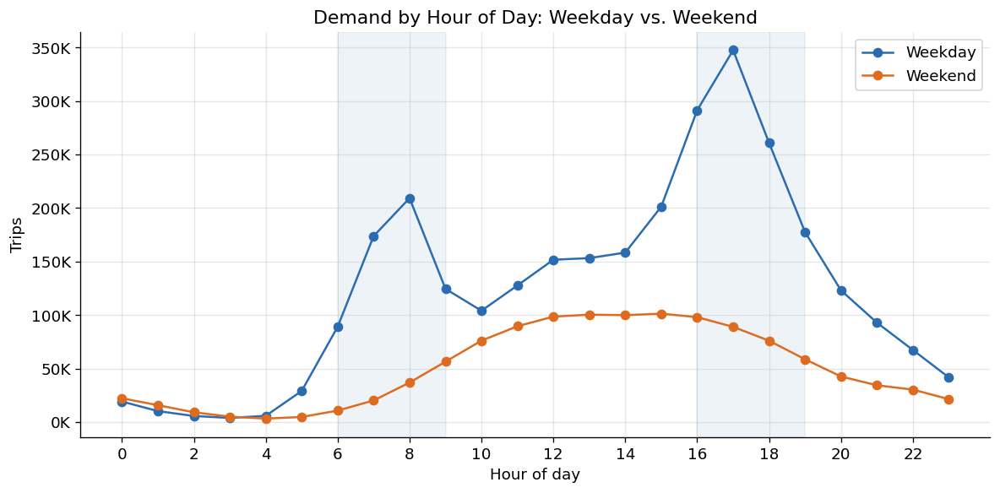
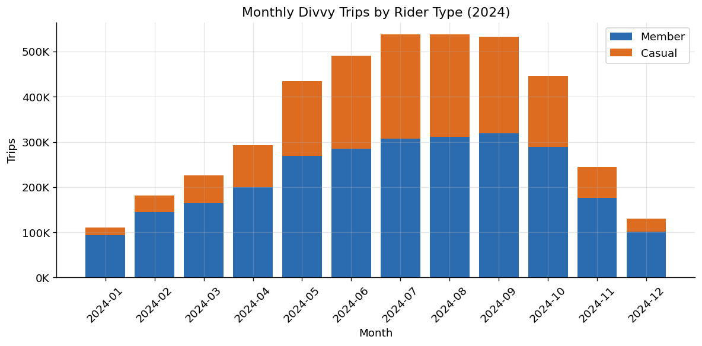
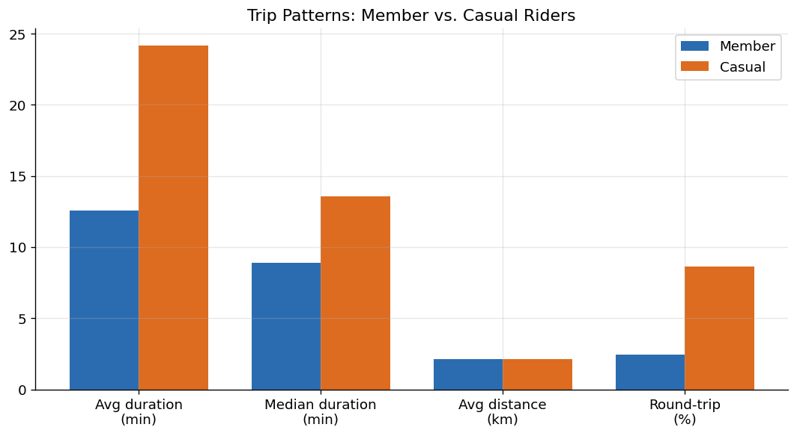
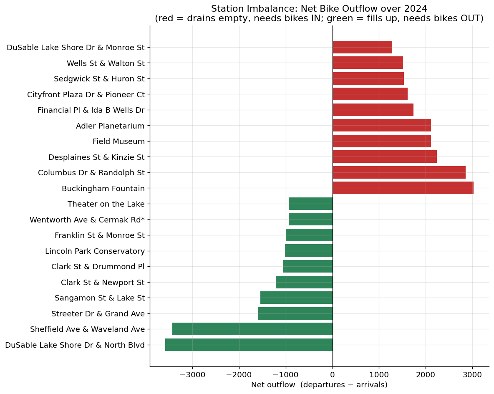

# Chicago Divvy Transit Analytics — Spark + AWS

End-to-end data pipeline that **collects, cleans, and analyzes ~5.9M Chicago
Divvy bike-share trips (2024)** with **Apache Spark** and **Spark SQL**, then
turns the results into **data-driven route-optimization recommendations**.

The project mirrors a cloud data-lake workflow: raw trip files are ingested from
a public **Amazon S3** bucket into a raw zone, processed by Spark into a curated
Parquet zone, and queried with SQL to study bike usage, trip patterns,
time-of-day demand, and route/station activity.



---

## Why this project

Bike-share operators win or lose on **where the bikes are**. A bike at an empty
station is lost revenue; a full dock turns away a returning rider. This pipeline
quantifies the demand and the structural imbalances in the network and converts
them into an operational plan — see
**[docs/recommendations.md](docs/recommendations.md)**.

---

## Architecture

```
            ┌─────────────────────────┐
            │  Divvy public S3 bucket │   divvy-tripdata.s3.amazonaws.com
            │   (monthly trip CSVs)   │
            └────────────┬────────────┘
                         │  01_ingest.py  (collect)
                         ▼
   data/raw/  ──────────────────────────────  RAW ZONE
        12 monthly CSVs (~1.1 GB, 5.86M rows)
                         │  02_clean.py  (Apache Spark)
                         │  • explicit schema, type-safe parse
                         │  • drop missing / duplicate / bad-GPS / bad-duration
                         │  • derive hour, day, season, daypart, distance, route
                         ▼
   data/processed/trips/ ───────────────────  CURATED ZONE
        Parquet, partitioned by month (4.17M clean rows)
                         │  03_analyze.py  (Spark SQL, sql/*.sql)
                         ▼
   output/*.csv  +  output/figures/*.png  ───  ANALYTICS + REPORT
                         │  04_visualize.py
                         ▼
        docs/recommendations.md  (route optimization)
```

**Local ↔ AWS mapping.** The pipeline runs entirely on a laptop, but every
stage has a one-to-one cloud equivalent, so it lifts to AWS with no code changes
to the Spark logic:

| This repo (local)              | Production on AWS                          |
|--------------------------------|--------------------------------------------|
| `data/raw/` landing zone       | `s3://<bucket>/raw/`                        |
| `data/processed/` Parquet      | `s3://<bucket>/curated/` (Parquet)         |
| `local[*]` SparkSession        | Amazon **EMR** Spark cluster / **Glue**    |
| Spark SQL on a temp view       | Spark SQL on EMR, or **Athena** over S3    |
| CSV/PNG in `output/`           | S3 results + **QuickSight** dashboards     |

The source data already lives on S3; pointing Spark at `s3a://` paths with the
`hadoop-aws` connector is the only change needed to run fully in the cloud.

---

## Tech stack
- **Apache Spark 3.5** (PySpark) — distributed cleaning + transformation
- **Spark SQL** — all analytics expressed as SQL (`sql/`)
- **Parquet** — columnar curated storage, partitioned by month
- **Amazon S3** — data source (public Divvy bucket)
- **pandas + matplotlib** — result export and charts
- **Python 3.9**, **Java 17** (Spark runtime)

---

## Data source
Divvy / Lyft publish anonymized monthly trip records (no PII) under the
[Divvy Data License Agreement](https://divvybikes.com/data-license-agreement):
<https://divvy-tripdata.s3.amazonaws.com/index.html>

Each trip row includes ride id, bike type, start/end timestamps, start/end
station + id, start/end latitude/longitude, and member-vs-casual rider type.

---

## How to run

```bash
# 1. Create an isolated environment and install dependencies
python3 -m venv .venv
source .venv/bin/activate            # Windows: .venv\Scripts\activate
pip install -r requirements.txt

# 2. Run the pipeline, stage by stage
python src/01_ingest.py              # download + unzip 12 months from S3
python src/02_clean.py               # Spark cleaning  -> curated Parquet
python src/03_analyze.py             # Spark SQL        -> output/*.csv
python src/04_visualize.py           # charts           -> output/figures/*.png
```

**Requirements:** Java 17 must be installed (Spark 3.5 does not support Java 21+).
On macOS: `brew install openjdk@17`. `src/config.py` auto-detects the Homebrew
Java 17 path; set `SPARK_JAVA_HOME` to override.

To run a quick smoke test instead of the full year, shorten the `MONTHS` list in
[`src/config.py`](src/config.py) (e.g. `["202401", "202402"]`).

---

## Results

**Trips are sharply seasonal** — summer carries 3.7× winter's volume, with a
higher share of casual riders:



**Members and casual riders are two different businesses** — members commute
(short, direct); casual riders ride ~2× longer and take more round trips:



**Stations have stable, directional imbalance** — the core route-optimization
signal. Red stations drain empty and need bikes trucked in; green stations fill
up and need bikes trucked out:



Full numbers in [`output/`](output/); narrative + recommendations in
[`docs/recommendations.md`](docs/recommendations.md).

### Headline recommendations
1. **Scheduled directional rebalancing** along the strongest sink→source corridors.
2. **Pre-position before the 7–9 AM and 4–6 PM peaks**, with a separate weekend plan.
3. **Add dock capacity** at chronically saturated lakefront stations.
4. **Guarantee reliability** on the top commuter (high-member) routes.
5. **Convert lakefront casual demand** into memberships, targeted by station + season.
6. **Scale operations to the seasonal curve**, not an annual average.

---

## Repository structure
```
divvy-spark-transit-analysis/
├── README.md
├── requirements.txt
├── .gitignore
├── src/
│   ├── config.py          # paths, month list, Spark/Java setup
│   ├── 01_ingest.py       # COLLECT  : download + unzip from S3
│   ├── 02_clean.py        # CLEAN    : Spark data-quality pipeline -> Parquet
│   ├── 03_analyze.py      # ANALYZE  : run sql/*.sql, export CSV results
│   └── 04_visualize.py    # VISUALIZE: charts from the CSV results
├── sql/                   # 10 Spark SQL analyses (usage, patterns, demand, routes)
├── output/                # CSV result tables + figures/ PNG charts
├── docs/
│   └── recommendations.md # route-optimization findings & recommendations
└── data/                  # raw/ + processed/ (git-ignored; rebuilt by the pipeline)
```

---

## Data-quality summary
Of 5,860,568 raw 2024 records, **4,168,072 (71.1%) passed cleaning**. Removed:
rows missing essential fields (notably dockless e-bike trips with no station,
~28%), duplicate ride ids, trips shorter than 1 minute or longer than 24 hours,
and GPS coordinates outside the Chicago service area. Each rule's row impact is
printed by `02_clean.py`.
```
Rows read from raw zone:            5,860,568
  after drop missing essentials     4,208,309
  after drop duplicate ride_ids     4,208,188
  after filter trip duration        4,168,072
  after filter GPS to Chicago bbox  4,168,072
Clean rows: 4,168,072  (71.1% of raw)
```
